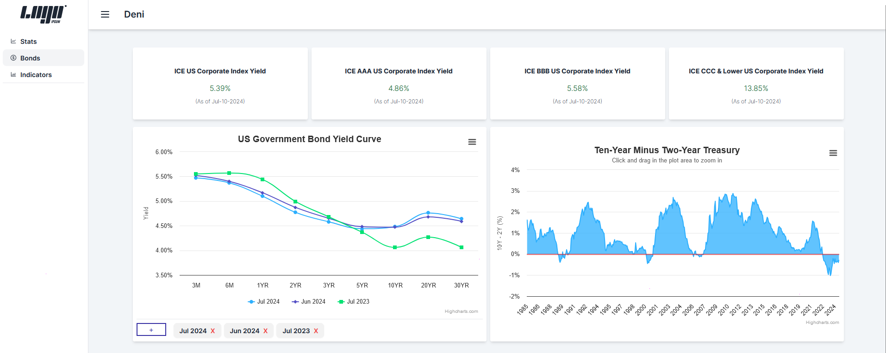
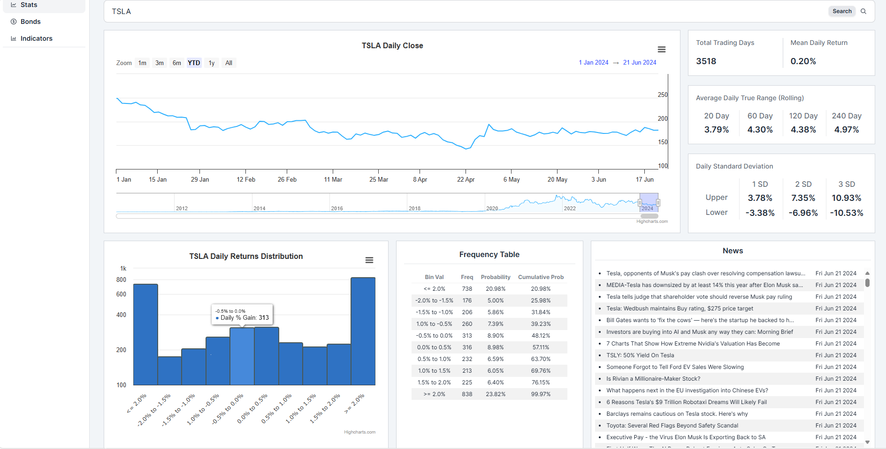

# Financial Dashboard

A financial markets dashboard that displays stats on the daily returns of publicly traded securities.

## Description

Right now, the dashboard displays historical daily close price, ATR (Average True Range) values, the 
distribution of daily returns, standard deviations as well as the US yield curve.

I mainly created this to get more exposure to the front end side of things.

A live preview is available here: [Live Preview](https://correl-frontend.vercel.app/stats)

### Images

## How it works

### .NET Core
* Provides APIs for retrieving bond, closing price and stat data.
* Hosted on Azure
* Uses .NET Minimal API

### Python
* Runs a daily query for new bond data provided by the FRED to update the DB tables.
* A module not included in this repo can also scrape economic indicator data but this is not used at the moment.
* Also used to build the initial database of data.
* Hosted on Azure.

### SQL
* Holds data on bonds for the respective country as I plan to implement a country context for each page.
* Hosted on Azure.

### Next.Js
* Handles all UI and some external API requests.
* Is responsive but not really meant to be used on mobile devices.
* Hosted on Vercel

## Todo:
- [x] Implement daily bonds data update
- [x] Rewrite python stat calculations into C#
- [ ] Add symbol search suggestions for /stats
- [ ] Implement Indicators page
- [ ] Add support for other countries

